<picture>
  <source media="(prefers-color-scheme: dark)" srcset="banner.svg">
  <source media="(prefers-color-scheme: light)" srcset="banner-light.svg">
  
</picture>

  

 

<table>
<tr>
<td width="34%" align="center"></td>
<td width="66%" valign="top">

### Selected Work

| Project | Discipline | Live |
|---|---|---|
| **Iron Flex** | Fitness brand experience | [Visit](https://iroflex.netlify.app) |
| **Nova Dental** | Clinic website & booking flow | [Visit](https://novva-dental.netlify.app) |
| **Zion Spa** | Wellness & treatments site | [Visit](https://zionspa.netlify.app) |

### Practice

I build fast, precise web interfaces and turn operational data into decisions
teams can act on. Two years inside a large manufacturing operation taught me
that clarity beats complexity — in code and in reporting alike.

</td>
</tr>
</table>

  

 

### Credentials

| Certification | Issuer | Verify |
|---|---|---|
| Google Data Analytics Professional Certificate | Google | [Verify](https://coursera.org/verify/professional-cert/M5N339PAEMG5) |
| Prompt Engineering Specialization | Vanderbilt University | [Verify](https://coursera.org/verify/specialization/2O7CE6MTLEP4) |
| Agentic AI and AI Agents for Leaders | Vanderbilt University | [Verify](https://coursera.org/verify/specialization/OQDFUJIC98HE) |

### Experience

| Period | Role | Organisation |
|---|---|---|
| 2025 — Present | Web Developer | Freelance / Knoxa |
| 2023 — 2025 | Data Analyst, Packaging Design, Supply Chain | Interloop Ltd |

 

### Contribution Rhythm

<picture>
  <source media="(prefers-color-scheme: dark)" srcset="https://raw.githubusercontent.com/gulraizx786/gulraizx786/output/github-contribution-grid-snake-dark.svg">
  <source media="(prefers-color-scheme: light)" srcset="https://raw.githubusercontent.com/gulraizx786/gulraizx786/output/github-contribution-grid-snake.svg">
  
</picture>

  

  

LAHORE, PAKISTAN &#8226; OPEN TO SELECT PROJECTS &#8226; iam@gulraizhassan.online

